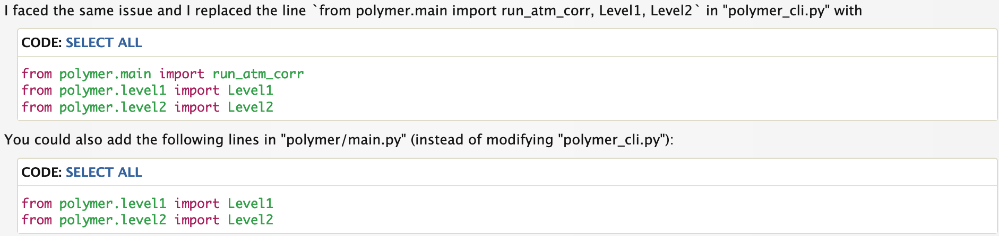

# Satellite Shellfish Modeling

---

Downloads and analyzes data from satellite images, for use in eventually
creating an open source shellfish growth model.

---

## Table of Contents

---

- [About](#1-about)
- [Installation](#2-installation)
- [Usage](#3-usage)
- [Contact](#4-contact)
- [License](#license)
- [TODO](#todo)

---

## 1. About

---

As of now this code allows the user to specify N bounding boxes and a time 
range, and then satellite images over that time range and over the specified 
bounding boxes are downloaded and some statistics generated before being 
saved to a csv. Code exists to create plots of data as well. Eventually this 
code will contain several models from various papers that serve to get 
useful data for the modeling of shellfish growth.

This uses both the SentinelHub and the Sentinelsat API, the prior of which
is paid and the former of which is free. As of now the SentinelHub API is
the one primarily used and the Sentinelsat API is just used for bands for
which we want to apply POLYMER. However, I will work to move more over to
the free service, so users have the option. Note that using Sentinelsat
exclusively will increase runtime substantially, due to the long term 
archive causing wait times for data requests more than a few months old.

---

## 2. Installation

---

### 2.1 My Code

To install you can start by cloning the repository

```shell
git clone https://github.com/AMcEnaney1/OceanSatelliteImages.git
```

Then using the provided environment.yaml file

```shell
conda env create -f environment.yaml
conda activate your-environment-name
```

### 2.2 POLYMER

The POLYMER algorithm called be downloaded from 
[Hygeos](https://www.hygeos.com/polymer), after making an account and 
accessing the forum. Once downloaded, unzip the downloaded folder and move
the contained polymer folder into the main directory of this project, 
note that this is currently the directory 'polymer-v4.16.1' in the
repository. You will need to move the scripts currently in this directory
into whichever you move in. Then to make the files navigate back to the polymer
directory and run the following commands:

```shell
make auxdata_all
make ancillary
make
```

Then, as above create the conda environment included with POLYMER, naming
it 'sentPoly'.

<details>
  <summary>As of v4.16.1 it is also necessary to make the changes outlined
in this <a href="https://forum.hygeos.com/viewtopic.php?f=7&t=218">
forum post</a>.</summary>
  
</details>

---

## 3. Usage

---

### 3.1 Setup and Configs

#### 3.1.1 Initialize Scripts

Before running the code you must first set permisions for the various
scripts included, to do so run the following commands:

```shell
chmod +x init.sh
./init.sh /absolute/path/to/project_directory
```

If you do not know it the absolute path to the project directory can be
obtained by moving into the project directory then using the command

```shell
pwd
```

Here you will also be prompted to enter the conda source path, this should
be the same as the one that will be placed in 'config.py'.

#### 3.1.2 Config

A few variables will need to be set in 'OceanSatelliteImages/config.py',
these being the polymer directory path, script folder path and 
the conda source path.

#### 3.1.3 POLYMER Ancillary Data

To get ancillary data working in polymer you must first create an account
on [Earthdata](https://urs.earthdata.nasa.gov/). We then need to create a 
'.netrc' file. Start by running these commands, ([source](https://oceancolor.gsfc.nasa.gov/data/download_methods/#download_sec))

```shell
echo "machine urs.earthdata.nasa.gov login USERNAME password PASSWD" > ~/.netrc ; > ~/.urs_cookies
chmod  0600 ~/.netrc
```
where USERNAME is replaced with your earthdata username and PASSWD your
password.

#### 3.1.4 API Keys

API keys must be entered into the 'conf/keys.py' file or otherwise configured. 
For SentinelHub information on API keys can be found [here](https://docs.sentinel-hub.com/api/latest/api/overview/authentication/)
and for Sentinelsat your API the keys are your username and password used 
[here](https://scihub.copernicus.eu/dhus/#/home).

#### 3.1.5 API Config

After setting your API keys you can set up the API confifgs in 
'conf/config.py':
If you are not using one of the APIs you need to comment out the lines 
containing its config, if you have added an API you can add its config here,
and if you have changed any variable names in 'conf/keys.py' you need to make
the change here as well.


### 3.2 Running Code

The code can be run from bash scripts or just from within python itself.
To view an example of running via bash you can go to the scripts directory
and run

```shell
./run.sh /absolute/path/to/project_directory
```

then enter the example inputs when prompted, this will run the 
'example_for_script.py' file. Note that you may be required to configure
conda to work within bash, this can be done with the following command:

```shell
conda init
```

Every file in the 'examples' folder can also just be run within python
without any issues.


### 3.3 Following Runs

For SentinelHub the program is written in such a way such that for subsequent runs of
the code, after the first, so long as the log file remains needless
api calls will not be made. What this means is if for example you 
accidentally entered the wrong end date the code could simply be run
again with the end date moved back, though you may want to delete 
generated figures first. If you do not want this behavior simply
delete the log file. To delete all the output data you can run:
```shell
./clean.sh /absolute/path/to/out/
```
where here 'out' is root folder for our outputs from the SentinelHub API.
The same can be done for your outputs from the Sentinelsat API, however 
may require some care, as you do not want to delete code.

### 3.4 Running POLYMER

As of now there is only a working script for running POLYMER on OLCI data 
included with my code,
see TODO list for issues here. This can be run on whole batches of folders
or individual ones. To do so use either the 'call_polymer()' or the 
'run_polymer_on_folder()' function, where the latter runs with a batch
of data. 

### 3.5 Modifying requests

#### 3.5.1 Adding SentinelHub requests

As is this code allows for both individual and bulk requests of satellite
bands from all [supported satellites](https://docs.sentinel-hub.com/api/latest/data/).

If you are adding a request of a singular band you need to first add an
evalscript to the 'evalscripts.py' file, then add the corresponding
request function to the 'requestFunctions.py' file.


#### 3.5.2 Adding Sentinelsat requests

To add a sentinelsat request you can define a new request function
in the 'request_functions.py' file. Documentation for creating
these exist [here](https://sentinelsat.readthedocs.io/en/latest/api_reference.html).

### 3.6 Examples

Examples of how to utilize the different functions are present in the
'examples' folder. This includes sentinelHub, sentinelsat, running POLYMER,
and applying linear models.

---

## 4. Contact

---

If you have any questions, suggestions, or feedback about this project, please feel free to reach out. You can contact me via:

- Email: firstname.lastname@maine.edu
- GitHub Issues: [Project Issues](https://github.com/AMcEnaney1/OceanSatelliteImages/issues)

This project is in active development and so setup can be a bit clunky,
I am happy to provide extra direction via email. My email can also be 
found on my profile.

---

## License

---

This project is licensed under the MIT License - see the [LICENSE](LICENSE.txt) file for details.

---

## TODO

---

### General

* When calling 'plot_ndarrys()' in 'satFunctions.py' we check to see if
the amount of dates plotted in less than or equal to 52. Ideally this
would be determined by how much ram is allocated by the user in a prompt.
* Local file/folder paths are still being used in places of the code,
these need to be changed to absolute file paths.
* If possible, moving over to virtual environments from conda would be
preferable, however due to POLYMER using conda this could make things 
annoying, in which case sticking with conda would be better.

### POLYMER

* Several arguments need to be fixed for olci script, these being: 
altitude (add DEM support), landmask (add GSW object support), 
datasets (fix list parsing), calib (fix dictionary parsing).
* Would like to get scripts for ascii, msi and meris implemented.
* Need to add bitmask and other post POLYMER operations.

### Models (Not all Possible)

* POM (Particulate Organic Matter)
* POC (Particulate Organic Carbon)
* Ocean Salinity
* Dissolved Oxygen
* Aerial Exposure (fraction of days exposed to air)
* TPM (Total Particulate Mass)
* PIM (Particulate Inorganic Mass)

---
